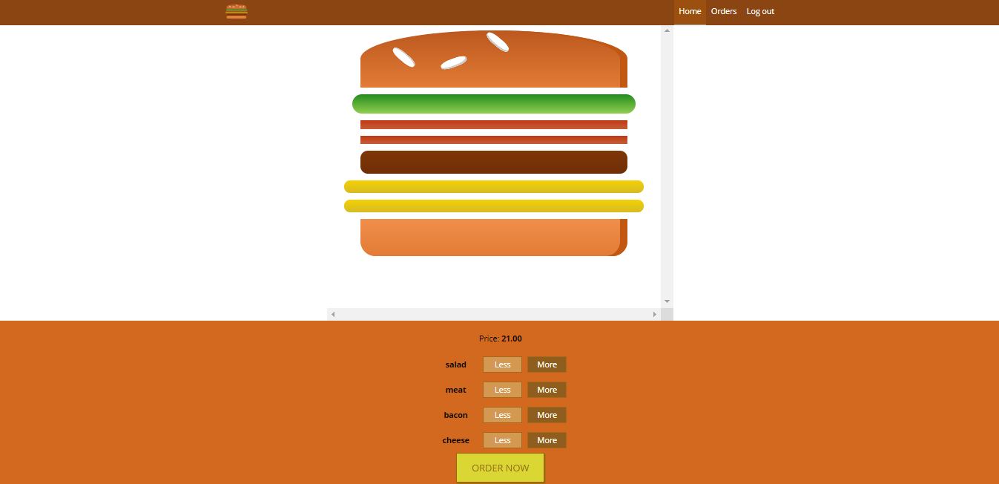
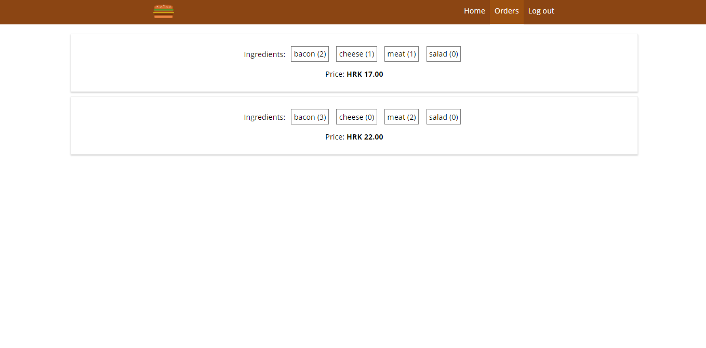

# BurgerApp

> app for ordering burgers

## Built with

- ReactJS, Redux
- Firebase

## Features

- Fetching data from Firebase
- User can pick burger ingredients
- Login & Signup
- A page with past orders
